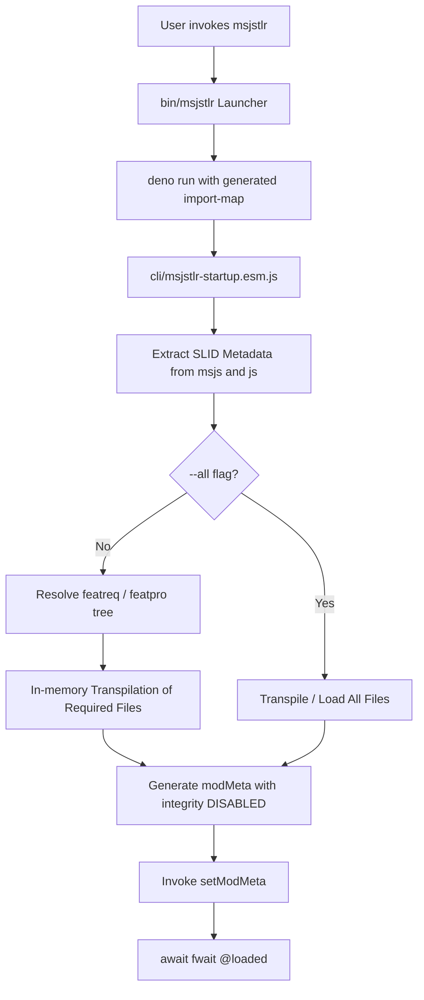

# Mesgjs TLR (Transpile-Load-Run)

## 1. Background

The standard process for creating and executing Mesgjs programs involves several steps and resources:

- Transpiling the Mesgjs `.msjs` file via [`cli/msjstrans-cli.esm.js`](cli/msjstrans-cli.esm.js), which:
  - Creates a JavaScript `.js` file
  - Records module location and dependency information in the Mesgjs catalog database
- "Loading" via [`cli/msjsload-cli.esm.js`](cli/msjsload-cli.esm.js), which:
  - Resolves version-specific dependencies
  - Creates an "entrypoint" `.js` file with appropriate import map entries and startup code
- Serving the transpiled, versioned modules (`.js` files) with a web server for URL-based, `fwait`-driven importing

While suitable for production deployments, this workflow introduces unnecessary friction for ad-hoc scripts, examples, quick testing, and local CLI tools.

---

## 2. Proposal

Implement a simpler, lightweight (ad-hoc) execution model that manages transpilation, dependency resolution, loading, and execution in a single command: `msjstlr`.

The command accepts a list of files (any combination of `.msjs` and `.js`), performs in-memory transpilation of `.msjs` sources, resolves dependencies between the provided files, dynamically configures runtime module metadata via [`src/runtime/runtime.esm.js:setModMeta()`](src/runtime/runtime.esm.js:180), and executes the entrypoint.

Dependency resolution is non-versioned (the user is responsible for supplying a compatible set of files).

---

## 3. Core Requirements & CLI Specification

### A. Runtime Root Resolution
- Locate Mesgjs runtime root directory containing [`src/lexparse.esm.js`](src/lexparse.esm.js), [`src/transpile.esm.js`](src/transpile.esm.js), and [`src/runtime/`](src/runtime/).
- Resolved in order of precedence:
  1. `-r <path>` / `--runtime <path>` CLI option
  2. `MESGJS_RUNTIME` environment variable
  3. Current workspace/repository directory default

### B. Dependency Resolution & Loading Flags
- **Default Execution Mode**:
  - Extracts in-file SLID configuration from each source file.
  - Starting from the `featreq` declarations of the primary entrypoint (the first file specified), recursively traverses and resolves dependencies against `featpro` declarations across all provided files.
  - Unresolved `featreq` requirements or duplicate `featpro` providers produce clear error diagnostics and terminate execution before loading.
- **`-a` / `--all` Flag**:
  - Bypasses the dependency pruning traversal and transpiles/loads every file provided on the command line.
- **`--deps-only` Flag**:
  - Runs the metadata extraction and dependency resolution phase verbosely, outputting the dependency tree, included files, and any diagnostics/errors, then exits immediately without running the program.

### C. CLI Syntax & Argument Disambiguation
- **Deno Flags**: Passed via `-d <deno-flags...> --` or `--deno <deno-flags...> --`.
- **General Invocation**:
  ```bash
  msjstlr [options] <files...> [-- <script-args...>]
  ```
- **Argument Forwarding**: All arguments following `--` (excluding Deno flags delimited by `--`) are passed directly to the user script and accessible through `Deno.args` or the Mesgjs runtime environment.

### D. Transpiler Options & Defaults
- In-memory transpilation passes `enableJS: true` and `debugBlocks: true` to [`src/transpile.esm.js:transpileTree()`](src/transpile.esm.js:34) by default (matching [`test/harness.esm.js:transpileMesgjs()`](test/harness.esm.js:42)).
- Flags `--disable-js` and `--disable-debug` allow disabling features explicitly.
- Setting `MESGJS_DEFAULT_DEBUG=false` in the environment disables debug blocks by default (overridable via `--enable-debug`).

### E. Launcher Script Specification ([`bin/msjstlr`](bin/msjstlr))
- [`bin/msjstlr`](bin/msjstlr) serves as the primary executable CLI entrypoint and shell wrapper.
- **Shebang Compatibility**: Supports executing Mesgjs scripts directly as executable binaries via `#!/usr/bin/env msjstlr` or `#!/path/to/bin/msjstlr`.
- **Default Deno Permissions**: By default, passes `--allow-read` and `--allow-env` to the Deno runtime, providing necessary access for file discovery, source loading, and environment variable inspection.
- **Permission & Flag Customization**: Additional Deno flags or custom permissions are supplied via `-d <deno-flags...> --` or `--deno <deno-flags...> --`.
- **Runtime Resolution & Forwarding**: Evaluates `-r`/`--runtime` or `MESGJS_RUNTIME` to identify the runtime root directory before launching Deno, generating the corresponding import map and passing remaining arguments to [`cli/msjstlr-startup.esm.js`](cli/msjstlr-startup.esm.js).

---

## 4. Technical Considerations & Edge Cases

### A. Module Integrity and Dynamic Loading
- In [`src/runtime/runtime.esm.js:loadModule()`](src/runtime/runtime.esm.js:386), if `globalThis.msjsHasModMeta` is set and `integrity` is not `'DISABLED'`, unverified modules fail integrity verification.
- Dynamically synthesized `modMeta` entries generated by TLR explicitly specify `integrity: 'DISABLED'` for all ad-hoc `.msjs` and `.js` modules.
- Transpiled `.msjs` modules are loaded in memory via base64 Data URLs (`data:application/javascript;base64,...`) in `modules[modPath].url`.

### B. Entrypoint Execution & `@loaded` Synchronization
- Mesgjs modules initialize asynchronously via `$c.fwait('@loaded')` or feature promises (see [`test/harness.esm.js:37`](test/harness.esm.js:37)).
- The startup engine [`cli/msjstlr-startup.esm.js`](cli/msjstlr-startup.esm.js) awaits `fwait('@loaded')` after invoking `setModMeta()` to ensure all top-level operations and asynchronous message flows complete prior to exit.

### C. Fallback for Module Path Identifiers
- When a `.msjs` or `.js` file does not contain an explicit `modpath` attribute in its SLID block, TLR derives a default `modPath` by stripping directory path prefixes and file extensions (`.msjs`, `.esm.js`, `.js`), consistent with [`cli/msjstrans-cli.esm.js:outPath()`](cli/msjstrans-cli.esm.js:64).

### D. Pre-Transpiled Module SLID Embedding (`msjstrans --inc-slid`)
- Add `--inc-slid` option to [`cli/msjstrans-cli.esm.js`](cli/msjstrans-cli.esm.js) to embed the in-file config-SLID block into transpiled `.js` output.
- The SLID content is parsed via `NANOS.parseSLID()` and regenerated with `NANOS.toSLID()` to strip any embedded comments (preventing premature termination of the enclosing `/*[(...)]*/` JS comment block).

### E. Launcher Script Symlink Traversal & Import Map Synthesis
- **Symlink Resolution**: When [`bin/msjstlr`](bin/msjstlr) is invoked via a symlink in `$PATH` (e.g. `/usr/local/bin/msjstlr` or `~/bin/msjstlr`), the launcher script resolves the canonical physical location of the Mesgjs repository to locate [`deno.json`](deno.json), [`cli/msjstlr-startup.esm.js`](cli/msjstlr-startup.esm.js), and runtime source modules.
- **Dynamic Import Map Construction**: Because `msjstlr` can be executed from any working directory, relative imports configured in the local working directory's `deno.json` (if any) will not resolve Mesgjs internal dependencies. The launcher constructs an inline JSON data URL import map mapping:
  - `"mesgjs/"` to `file://${RUNTIME_DIR}/`
  - `"@nanos"` to the resolved `@nanos` URL/module
  - `"@escape-js"` to the resolved `@escape-js` URL/module
  - `"@reactive"` to the resolved `@reactive` URL/module
- **CLI Argument Partitioning**:
  - The launcher scans arguments to extract `-r`/`--runtime <path>` for runtime location overriding.
  - The launcher intercepts `-d <deno-flags...> --` / `--deno <deno-flags...> --` and extracts all enclosed flags to pass directly to `deno run`.
  - All other flags, files, and options are preserved in order and forwarded to [`cli/msjstlr-startup.esm.js`](cli/msjstlr-startup.esm.js).
  - Script arguments following `--` are preserved and forwarded intact.

---

## 5. Architecture & Implementation Plan



### Component 1: `msjstrans` SLID Embedding (`--inc-slid`)
- **File**: [`cli/msjstrans-cli.esm.js`](cli/msjstrans-cli.esm.js)
- **Changes**:
  1. Add `--inc-slid` CLI flag.
  2. When enabled and `configSLID` is present:
     - Parse `configSLID` via `NANOS.parseSLID(configSLID)`.
     - Regenerate normalized SLID string via `.toSLID()` to strip comments.
     - Prepend `/*${regeneratedSLID}*/\n` to the generated `.js` file output (where `.toSLID()` includes the `[(` and `)]` boundary markers).

### Component 2: Launcher Script (`bin/msjstlr`)
- **File**: [`bin/msjstlr`](bin/msjstlr)
- **Responsibilities**:
  1. **Canonical Path & Runtime Resolution**:
     - Resolve physical script location across symlinks:
       ```bash
       SOURCE="${BASH_SOURCE[0]}"
       while [ -L "$SOURCE" ]; do
         DIR="$( cd -P "$( dirname "$SOURCE" )" >/dev/null 2>&1 && pwd )"
         SOURCE="$(readlink "$SOURCE")"
         [[ $SOURCE != /* ]] && SOURCE="$DIR/$SOURCE"
       done
       SCRIPT_DIR="$( cd -P "$( dirname "$SOURCE" )" >/dev/null 2>&1 && pwd )"
       ```
     - Resolve `RUNTIME_DIR` in order: `-r <path>` / `--runtime <path>`, then `MESGJS_RUNTIME` env var, then default `SCRIPT_DIR/..`.
  2. **Argument Parsing & Separation**:
     - Extract `-d ... --` / `--deno ... --` flags into `DENO_FLAGS` array.
     - Extract `-r <path>` / `--runtime <path>` into `RUNTIME_DIR`.
     - Collect all remaining parameters (including `-- <script-args...>`) into `MSJSTLR_ARGS` array.
  3. **Import Map Synthesis**:
     - Construct inline JSON import map targeting the resolved `RUNTIME_DIR`:
       ```bash
       IMPORT_MAP="{\"imports\":{\"mesgjs/\":\"file://${RUNTIME_DIR}/\",\"@escape-js\":\"https://cdn.jsdelivr.net/gh/mesgjs/escape-js@0.1.0/src/escape.esm.js\",\"@nanos\":\"https://cdn.jsdelivr.net/gh/mesgjs/nanos@1.5.1/src/nanos.esm.js\",\"@reactive\":\"https://cdn.jsdelivr.net/gh/mesgjs/reactive@0.1.6/src/reactive.esm.js\"}}"
       IMPORT_MAP_DATA_URL="data:application/json;charset=utf-8,${IMPORT_MAP}"
       ```
  4. **Process Execution**:
     - Invoke Deno with default `--allow-read --allow-env` plus any user-specified `DENO_FLAGS`:
       ```bash
       exec deno run --import-map="$IMPORT_MAP_DATA_URL" --allow-read --allow-env "${DENO_FLAGS[@]}" "$RUNTIME_DIR/cli/msjstlr-startup.esm.js" "${MSJSTLR_ARGS[@]}"
       ```

### Component 3: Startup & Resolver Engine (`cli/msjstlr-startup.esm.js`)
- **File**: [`cli/msjstlr-startup.esm.js`](cli/msjstlr-startup.esm.js)
- **Responsibilities**:
  1. **Metadata Extraction**:
     - `.msjs` files: Extract `configSLID` using [`src/lexparse.esm.js:lex()`](src/lexparse.esm.js:25).
     - `.js` files: Read the initial 4KB chunk to check for the initial boundary marker
	   - If the initial boundary marker is present, read and assemble additional chunks if necessary until the terminal boundary marker is found and then parse the configuration (`.parseSLID` automatically ignores everything outside of the boundaries).
  2. **Dependency Resolution**:
     - Start traversal from the first file's `featreq`.
     - Recursively match requirements against `featpro` across all provided files.
     - Validate that every required feature is provided exactly once (flag missing dependencies and duplicate providers as errors).
     - Support `--deps-only` to display resolution diagnostics and exit.
  3. **In-Memory Transpilation & Metadata Registration**:
     - Transpile required `.msjs` files via [`src/transpile.esm.js:transpileTree()`](src/transpile.esm.js:34).
     - Construct dynamic `modMeta` structure:
       ```javascript
       {
         testMode: true,
         modules: {
           [modPath]: {
             url: "data:application/javascript;base64," + b64Code, // or local file path for .js
             integrity: "DISABLED",
             deferLoad: false,
             featpro: [...],
             featreq: [...]
           }
         }
       }
       ```
     - Invoke `setModMeta(modMeta)` and `await fwait('@loaded')`.

---

## 6. Testing Plan

### A. Unit Testing
1. **`msjstrans --inc-slid`**:
   - Verify SLID comments (`/* ... */`) within `.msjs` are stripped from the regenerated `/*[(...)]*/` block.
   - Verify parsing generated `.js` files reproduces the original SLID properties.
2. **SLID Extraction**:
   - Test `.msjs` files with shebang, without shebang, and without SLID block.
   - Test `.js` files with SLID in first 4KB, without SLID, and with SLID exceeding 4KB boundary.
3. **Dependency Resolution Algorithm**:
   - Single-file program (no external dependencies).
   - Linear dependency chain (`A -> B -> C`).
   - Circular dependency (`A -> B -> A`).
   - Diamond dependency graph (`A -> B, C; B -> D; C -> D`).
   - Missing required feature (assert error diagnostic and non-zero exit code).
   - Duplicate feature provider (assert error diagnostic and non-zero exit code).
   - `--deps-only` diagnostic output validation.
   - `-a` / `--all` flag bypassing dependency pruning.

### B. Integration Testing
1. **Direct Execution**:
   - Standalone `.msjs` program via `bin/msjstlr example.msjs`.
   - Multi-module program mixing `.msjs` and `.js` source files.
2. **Launcher Script (`bin/msjstlr`)**:
   - Symlink invocation (invoking via a symlink in another directory).
   - Runtime path override via `-r <path>` and `MESGJS_RUNTIME` env var.
   - External working directory execution (invoking from outside the Mesgjs repo).
3. **Flag Pass-Through**:
   - Verify `-d --allow-net --` passes permissions to the Deno runtime.
   - Verify script arguments pass through after `--` into `Deno.args`.
4. **Shebang Execution**:
   - Executable script using `#!/usr/bin/env msjstlr` with direct CLI invocation.
